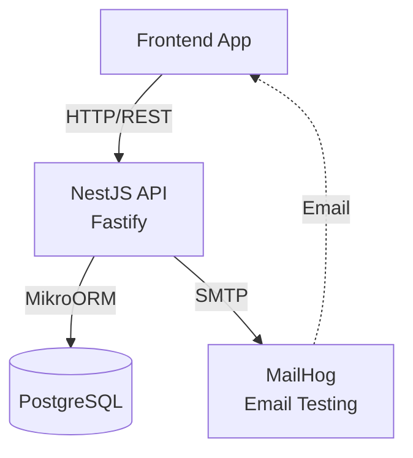
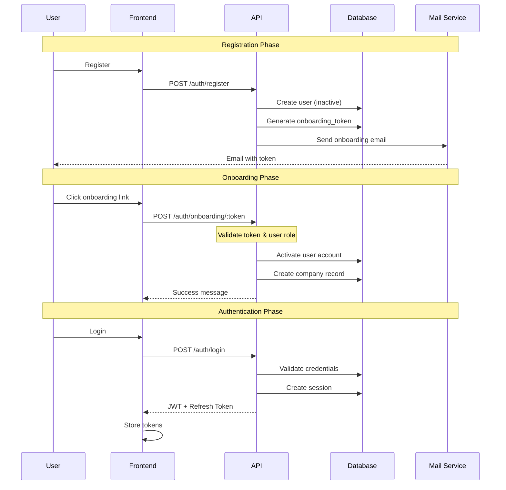
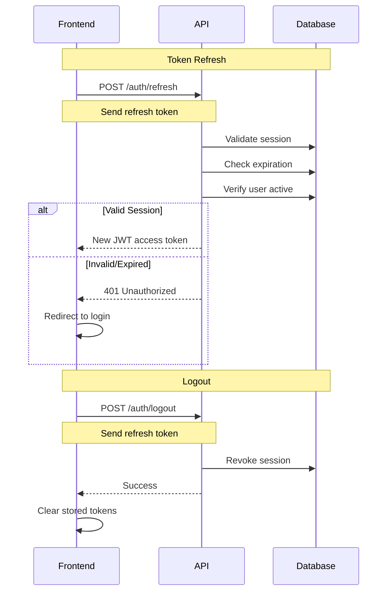
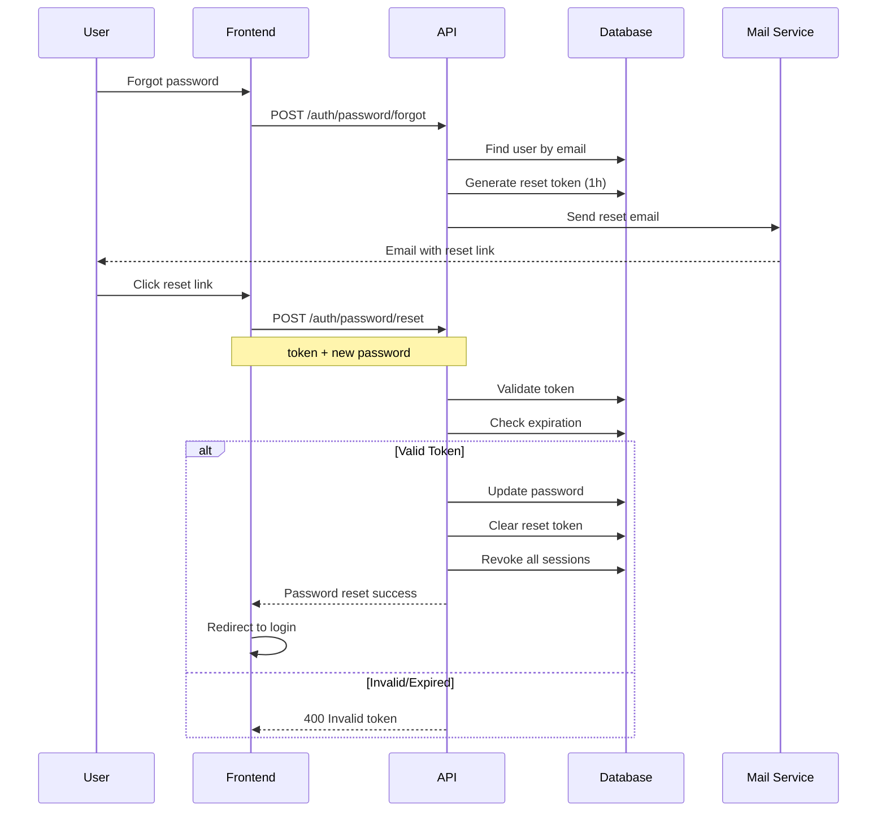
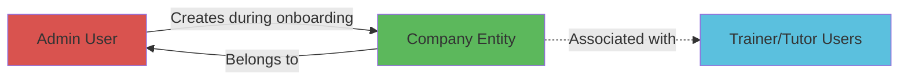

# Barksys - Architecture Documentation

Learning Management System with multi-tenant company support and role-based access.

## System Architecture



## Authentication & Onboarding Flow



## Session Management



## Password Reset Flow



## Company Management



## Tech Stack

### Backend
- **NestJS** - Progressive Node.js framework
- **Fastify** - High-performance web server
- **MikroORM 6** - TypeScript ORM with migrations
- **PostgreSQL 17** - Relational database
- **Passport** - Authentication middleware
- **JWT** - JSON Web Tokens for stateless auth

### Email & Notifications
- **Nodemailer** - Email sending
- **MailHog** - Email testing (development)
- **EJS** - Email template engine
- **EventEmitter** - Event-driven notifications

### Internationalization
- **nestjs-i18n** - i18n support
- Languages: English (en), Portuguese (pt)

### Messaging (Prepared)
- **NATS** - Microservices communication (ready for future use)

### API Documentation
- **Swagger/OpenAPI** - Interactive API docs
- Available at: `/api/docs`

### Security
- **bcrypt** - Password hashing
- **class-validator** - DTO validation
- **class-transformer** - Data transformation

## Database Schema

### Entities

#### User
- **Fields**: id (UUID), email, full_name, password_hash, role
- **Roles**: ADMIN, TRAINER, TUTOR
- **Auth**: onboarding_token, password_reset_token
- **Status**: is_active, is_email_verified
- **Audit**: created_at, updated_at, password_changed_at

#### Company
- **Fields**: id (UUID), name, email, tax_id, tax_type
- **Tax Types**: NIF, VAT, NIPC
- **Location**: billing_address, city, country (default: PT), postal_code
- **Relations**: user_id (ManyToOne → User)
- **Audit**: created_at, updated_at

#### Session
- **Fields**: id (UUID), email, refresh_token
- **Metadata**: user_agent, client_ip
- **Status**: is_blocked, expires_at
- **Audit**: created_at

#### Notification
- **Fields**: id (UUID), channel, recipient, subject
- **Template**: template_name, template_context (JSONB)
- **Status**: pending, sent, failed, delivered
- **Tracking**: sent_at, delivered_at, read, read_at
- **Relations**: user_id (optional)

## Key Features

### 1. Authentication System
- User registration with email verification
- JWT-based authentication with refresh tokens
- Session management with automatic expiration
- Password reset with time-limited tokens
- Multi-device session tracking

### 2. Company Onboarding
- Integrated user activation and company registration
- Admin-only onboarding process
- Tax identification validation (NIF/VAT/NIPC)
- Billing address and location tracking
- Transactional data integrity

### 3. User Management
- Role-based access control (RBAC)
- Three user roles: Admin, Trainer, Tutor
- Email verification required
- Account activation workflow
- Password change with session revocation

### 4. Notification System
- Event-driven architecture
- Email notifications with EJS templates
- Support for multiple channels (email, sms, push)
- Delivery status tracking
- Read receipts
- Multi-language email templates

### 5. Internationalization
- English and Portuguese language support
- Localized validation messages
- Translated email templates
- API response translations

### 6. Security Features
- Password hashing with bcrypt (10 rounds)
- Token-based password reset (1 hour expiration)
- Onboarding token (24 hours expiration)
- Refresh token rotation
- Session revocation on password change
- IP and user agent tracking

## Module Structure

```
api/src/
├── modules/
│   ├── auth/
│   │   ├── decorators/      # @CurrentUser, @Public
│   │   ├── dto/             # Login, Register, Onboarding DTOs
│   │   ├── guards/          # JwtAuthGuard, LocalAuthGuard
│   │   ├── strategies/      # JWT, Local strategies
│   │   ├── auth.controller.ts
│   │   ├── auth.service.ts
│   │   └── auth.module.ts
│   │
│   ├── users/
│   │   ├── entities/        # User entity with roles
│   │   ├── dto/             # CreateUser, UpdateUser
│   │   ├── users.controller.ts (future)
│   │   ├── users.service.ts
│   │   └── users.module.ts
│   │
│   ├── companies/
│   │   ├── entities/        # Company entity
│   │   ├── dto/             # CreateCompany DTO
│   │   ├── companies.service.ts
│   │   └── companies.module.ts
│   │
│   ├── sessions/
│   │   ├── entities/        # Session entity
│   │   ├── sessions.service.ts
│   │   └── sessions.module.ts
│   │
│   └── notifications/
│       ├── entities/        # Notification entity
│       ├── events/          # UserRegistered, PasswordReset events
│       ├── templates/       # EJS email templates
│       ├── notifications.service.ts
│       └── notifications.module.ts
│
├── common/
│   ├── interfaces/          # JwtPayload
│   └── ...
│
├── i18n/
│   └── locales/
│       ├── en/              # English translations
│       │   ├── auth.json
│       │   └── notifications.json
│       └── pt/              # Portuguese translations
│           ├── auth.json
│           └── notifications.json
│
├── migrations/              # Database migrations
│   ├── Migration20251013000000.ts  # Initial schema
│   └── Migration20251013000001.ts  # Companies table
│
├── mikro-orm.config.ts     # ORM configuration
├── app.module.ts           # Root module
└── main.ts                 # Bootstrap application
```

## API Endpoints

### Authentication
- `POST /api/auth/register` - Register new user
- `POST /api/auth/login` - Authenticate user
- `POST /api/auth/onboarding/:token` - Complete onboarding
- `POST /api/auth/onboarding/resend` - Resend onboarding email
- `POST /api/auth/password/forgot` - Request password reset
- `POST /api/auth/password/reset` - Reset password with token
- `POST /api/auth/refresh` - Refresh access token
- `POST /api/auth/logout` - Logout and revoke session

### API Documentation
- `GET /api/docs` - Swagger UI
- `GET /api/health` - Health check endpoint

## Environment Setup

### Required Environment Variables

```bash
# Application
NODE_ENV=development
PORT=3000
APP_URL=http://localhost:4200

# Database
DATABASE_HOST=localhost
DATABASE_PORT=5432
DATABASE_USER=root
DATABASE_PASSWORD=secret
DATABASE_NAME=barksys

# Authentication
JWT_SECRET=your-super-secret-jwt-key-change-in-production
JWT_EXPIRES_IN=15m
REFRESH_TOKEN_EXPIRES_IN=7d

# Email (Development)
MAIL_HOST=localhost
MAIL_PORT=1025
MAIL_USER=
MAIL_PASSWORD=
MAIL_FROM=noreply@barksys.com

# Email (Production - example)
# MAIL_HOST=smtp.gmail.com
# MAIL_PORT=587
# MAIL_USER=your-email@gmail.com
# MAIL_PASSWORD=your-app-password
```

## Docker Setup

### Services

```yaml
services:
  postgres:      # PostgreSQL 17.4
    - Port: 5432
    - Volume: postgres_data

  mailhog:       # Email testing
    - SMTP: 1025
    - Web UI: 8025

  migrations:    # Database migrations
    - Runs before API

  api:           # NestJS API
    - Port: 3000
    - Depends on: postgres, mailhog, migrations
```

### Container Startup Order
1. PostgreSQL starts and waits for health check
2. MailHog starts
3. Migrations run and complete
4. API starts and serves requests

## Development

### Prerequisites
- Node.js 20+
- pnpm 9+
- Docker & Docker Compose
- PostgreSQL client (optional)

### Setup

```bash
# Clone repository
git clone <repository-url>
cd barksys

# Install dependencies
cd api && pnpm install

# Setup environment
cp api/.env.example api/.env
# Edit .env with your configuration

# Start infrastructure (PostgreSQL + MailHog)
docker-compose up postgres mailhog -d

# Run migrations
cd api && pnpm run migration:up

# Start API in development mode
pnpm run start:dev
```

### Using Docker Compose

```bash
# Start all services
docker-compose up -d

# View logs
docker-compose logs -f api

# Stop all services
docker-compose down

# Rebuild and start
docker-compose up --build -d

# Reset database
docker-compose down -v
docker-compose up -d
```

### Database Migrations

```bash
# Create new migration
pnpm run migration:create --name=add-feature

# Run pending migrations
pnpm run migration:up

# Rollback last migration
pnpm run migration:down

# List all migrations
pnpm run migration:list

# Show pending migrations
pnpm run migration:pending

# Fresh database (drop + recreate + migrate)
pnpm run migration:fresh
```

### Testing

```bash
# Run unit tests
pnpm test

# Run tests in watch mode
pnpm test:watch

# Generate coverage report
pnpm test:cov

# Run e2e tests
pnpm test:e2e
```

### Email Testing

Access MailHog web interface:
- URL: http://localhost:8025
- View all sent emails
- Inspect email content and headers
- Test email templates

### API Documentation

Access Swagger UI:
- URL: http://localhost:3000/api/docs
- Interactive API testing
- Request/response schemas
- Authentication testing with Bearer token

## Contributing

### Git Workflow
1. Create feature branch: `git checkout -b feature/feature-name`
2. Make changes and commit: `git commit -m "feat: description"`
3. Push to remote: `git push -u origin feature/feature-name`
4. Create Pull Request to `main` branch

### Commit Conventions
Follow conventional commits format:
- `feat:` - New feature
- `fix:` - Bug fix
- `refactor:` - Code refactoring
- `docs:` - Documentation updates
- `test:` - Test additions/updates
- `chore:` - Maintenance tasks

### Code Style
- Use ESLint and Prettier configurations
- Follow NestJS best practices
- Write self-documenting code
- Add comments for complex logic
- Keep functions small and focused

## License

[License Type] - See LICENSE file for details

## Support

For questions or issues:
- Create an issue in the repository
- Contact: [support email]
- Documentation: This README

---

Last updated: October 2025
